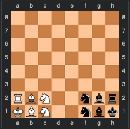

# Chess Variant Project

Here is the starting position for the game:

As in standard chess, white moves first. The first player to move their king onto row 8 is the winner, unless black finishes the next move after white does, in which case it's a tie. Pieces move and capture the same as in standard chess. As in standard chess, a player is not allowed to expose their own king to check (including moving a piece that was blocking a check such that it no longer does). **Unlike** standard chess, a player is not allowed to put the opponent's king in check (including moving a piece that was blocking a check such that it no longer does).
